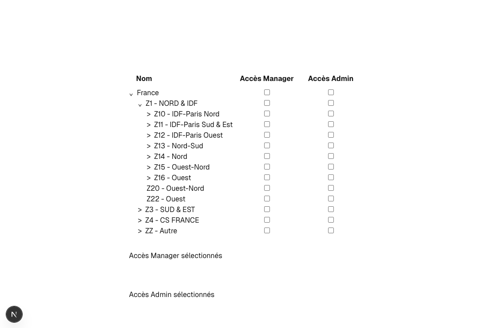

## Description

This project is a technical test, the purpose is to dynamically check and uncheck children and the relative parent.

## Preview

## Process

I needed to find a way to parse the provided json, the difficulty was to keep the relation between a parent and its children. 
Using a Shop class enabled me to facilitate the value updating, all the reasoning is contained in the **@/class/Shop**, from the creation of each Shop, to the check of access.

## Thank you

*Developed by Alyssia Colomar*
September 2025